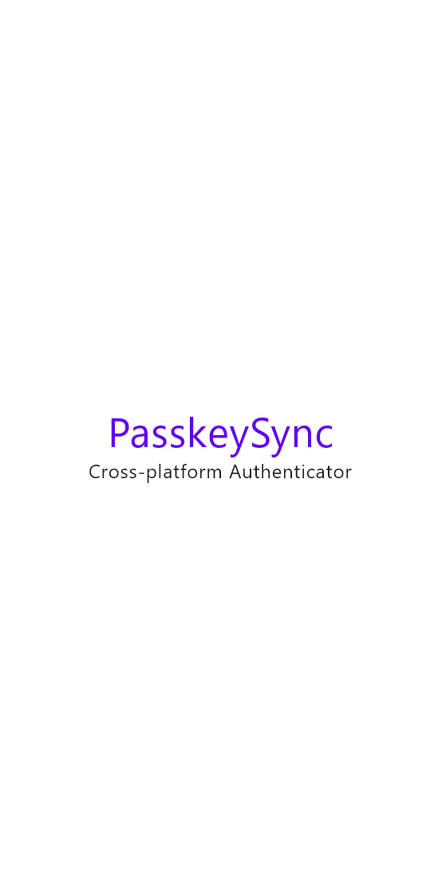
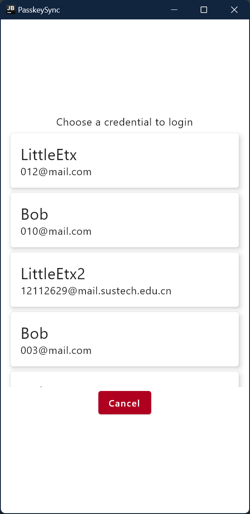
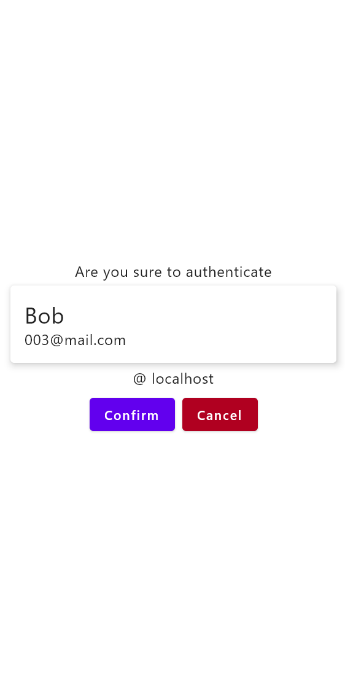

# Passkey Demo - PasskeySync Authenticator

A software authenticator
for [CTAP](https://fidoalliance.org/specs/fido-v2.2-rd-20230321/fido-client-to-authenticator-protocol-v2.2-rd-20230321.html),
implemented in
Kotlin [Compose Multiplatform](https://www.jetbrains.com/help/kotlin-multiplatform-dev/get-started.html).

Note that this authenticator only works with the
modified [client](https://github.com/PasskeySync/relying-party-web), Websocket is used for CTAP
communication.

Due to time unavailability, only the desktop version is implemented.

## Screenshots

